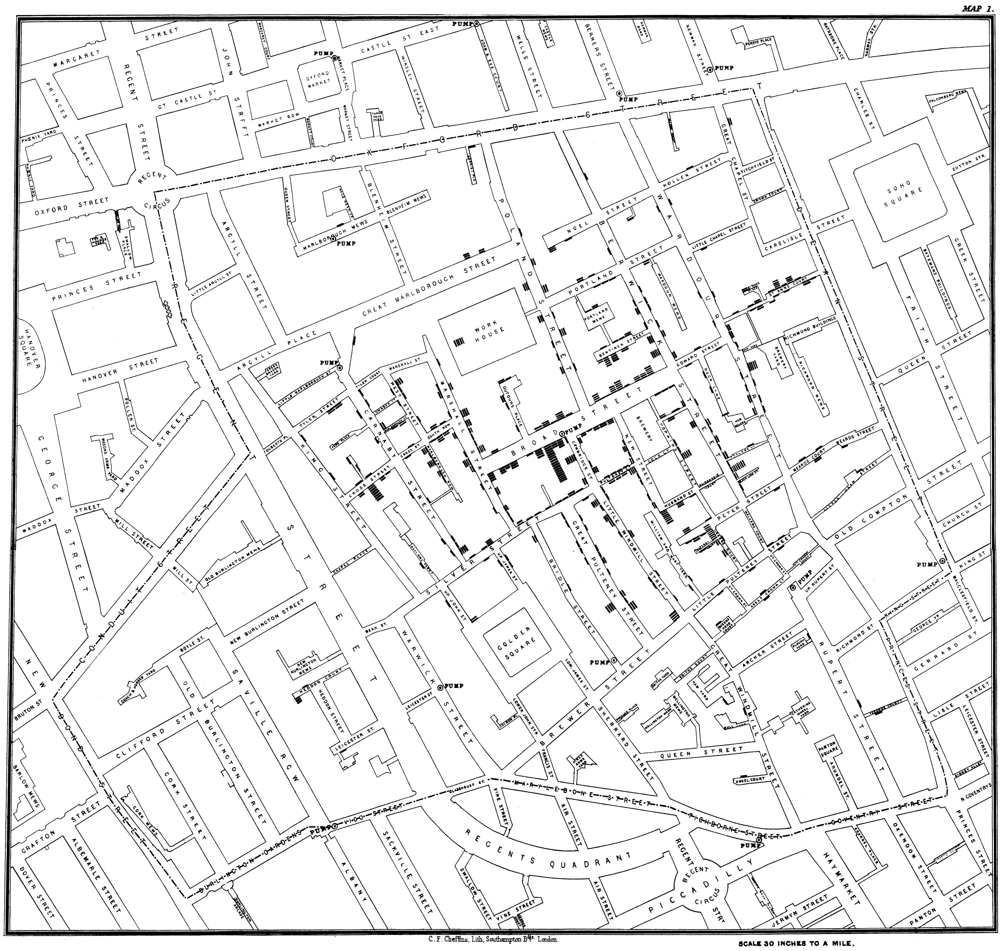
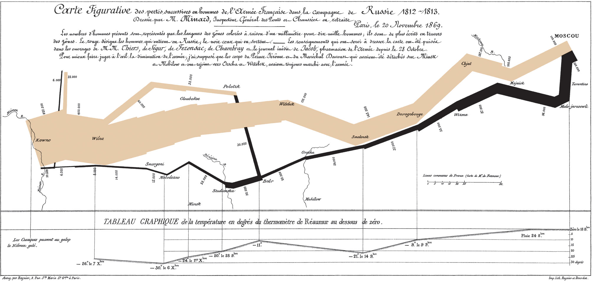
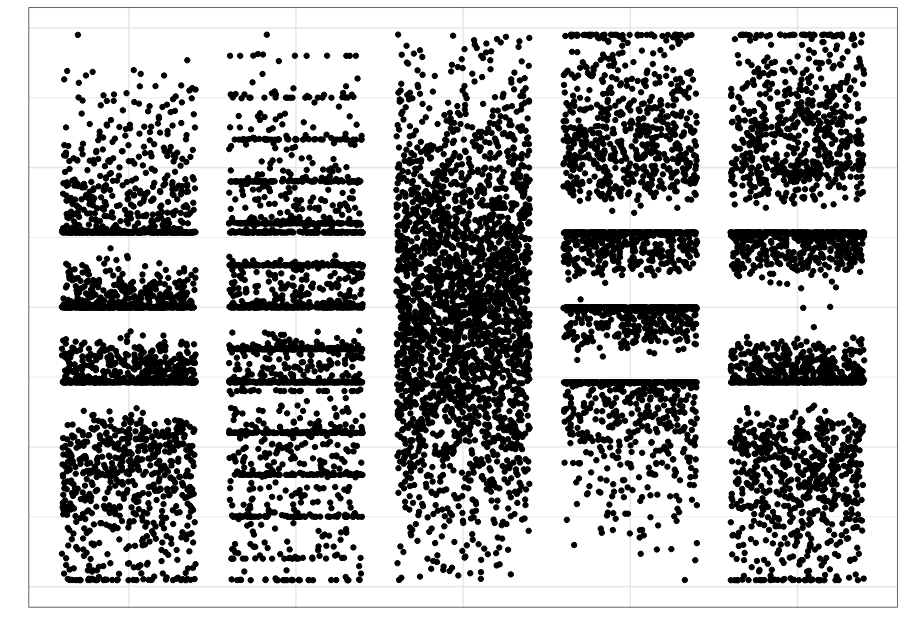
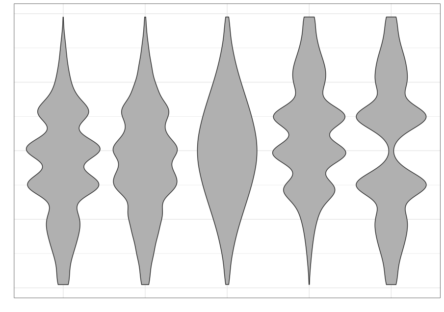

---
jupyter:
  jupytext:
    formats: ipynb,py:percent,Rmd
    text_representation:
      extension: .Rmd
      format_name: rmarkdown
      format_version: '1.2'
      jupytext_version: 1.4.2
  kernelspec:
    display_name: Python 3
    language: python
    name: python3
---

# Data visualization using Python

## Introduction

Data visualization is a basic task in data exploration and understanding. Humans are mainly visual creatures, and data visualization provides an opportunity to enhance communication of the story within the data. Often we find that data and the data-generating process is complex, and a visual representation of the data and our innate ability at pattern recognition can help reveal the complexities in a cognitively accessible way.

### An example gallery

Data visualization has a long and storied history, from Florence Nightangle onwards. Dr. Nightangle was a pioneer in data visualization and developed the *rose plot* to represent causes of death in hospitals during the Crimean War.


 John Snow, in 1854, famously visualized the cholera outbreak in London, which showed the geographic proximity of cholera prevalence with particular water wells.



In one of the more famous visualizations, considered by many to be an optimal use of display ink and space, Minard visualized Napoleon's disastrous campaign to Russia



In more recent times, an employee at Facebook visualized all connections between users across the world, which clearly showed geographical associations with particular countries and regions.


### Why visualize data?

We often rely on numerical summaries to help understand and distinguish datasets. In 1973, Anscombe published an influential set of 4 datasets, each with two variables and with the means, variances and correlations being identical. When you graphed these data, the differences in the datasets were clearly visible. This set is popularly known as Anscombe's quartet.


A more recent experiment in data construction by Matejka and Fitzmaurice (2017) started with a representation of a dinosaur and created 10 more bivariate datasets which all shared the same univariate means and variances and the same pairwise correlations.


These examples clarify the need for visualization to better understand relationships between variables. 

Even when using statistical visualization techniques, one has to be careful. Not all visualizations can discriminate between statistical characteristics. This was also explored by Matejka and Fitzmaurice. 

|      Strip plot      |       Boxplot        |     Violin plot      |
| :------------------: | :------------------: | :------------------: |
|  |  |  |

### Conceptual ideas

#### Begin with the consumer in mind

+ You have a deep understanding of the data you're presenting
+ The person seeing the visualization **doesn't**
+ Develop simpler visualizations first that are easier to explain

#### Tell a story

+ Make sure the graphic is clear
+ Make sure the main point you want to make "pops"

#### A matter of perception

+ Color (including awareness of color deficiencies)
+ Shape
+ Fonts

#### Some principles

1. Data-ink ratio
2. No mental gymnastics
    1. The graphic should be self-evident
    2. Context should be clear
3. Is a graph the wrong choice?
4. Focus on the consumer

> See [my slides](http://araastat.com/BIOF439/lectures/01-DataViz.pdf) for some more opinionated ideas

## Plotting in Python

Let's take a very quick tour before we get into the weeds. We'll use the mtcars dataset as an exemplar dataset that we can import using `pandas`

```{python}
import numpy as np
import pandas as pd
import matplotlib.pyplot as plt
plt.style.use('seaborn-notebook')

mtcars = pd.read_csv('data/mtcars.csv')
```
### Static plots

We will demonstrate plotting in what I'll call the `matplotlib` ecosystem. `matplotlib` is the venerable and powerful visualization package that was originally designed to emulate the Matlab plotting paradigm. It has since evolved and as become a bit more user-friendly. It is still quite granular and can facilitate a lot of custom plots once you become familiar with it. However, as a starting point, I think it's a bit much. We'll see a bit of what it can offer later.


We will consider two other options which are built on top of `matplotlib`, but are much more accessible. These are `pandas` and `seaborn`. The two packages have some different approaches, but both wrap `matplotlib` in higher-level code and decent choices so we don't need to get into the `matplotlib` trenches quite so much. We'll still call `matplotlib` in our code, since both these packages need it for some fine tuning. Both packages are also very much aligned to the `DataFrame` construct in `pandas`, so makes plotting a much more seamless experience. 

```{python}
mtcars.plot.scatter(x = 'hp', y = 'mpg');
# mtcars.plot(x = 'hp', y = 'mpg', kind = 'scatter');
```

```{python}
import seaborn as sns
sns.scatterplot(data = mtcars, x = 'hp', y = 'mpg');
```

There are of course some other choices based on your background and preferences. For static plots, there are a couple of emulators of the popular R package `ggplot2`. These are `plotnine` and `ggplot`. `plotnine` seems a bit more developed and uses the `ggplot2` semantics of aesthetics and layers, with almost identical code syntax. 

> You can install `plotnine` using `conda`: 
>
> ```shell
> conda install -c conda-forge plotnine
> ```

```{python}
from plotnine import *

(ggplot(mtcars) + 
  aes(x = 'hp', y = 'mpg') +
  geom_point())
```

### Dynamic or interactive plots

There are several Python packages that wrap around Javascript plotting libraries that are so popular in web-based graphics like D3 and Vega. Three that deserve mention are `plotly`, `bokeh`, and `altair`.


`plotly` is a Python package developed by the company [Plot.ly](https://www.plotly.com) to interface with their interactive Javascript library either locally or via their web service. Plot.ly also develops an R package to interface with their products as well. It provides an intuitive syntax and ease of use, and is probably the more popular package for interactive graphics from both R and Python.

```{python}
import plotly.express as px

fig = px.scatter(mtcars, x = 'hp', y = 'mpg')
fig.show()
```

`bokeh` is an interactive visualization package developed by Anaconda. It is quite powerful, but its code can be rather verbose and granular

```{python}
from bokeh.plotting import figure, output_file
from bokeh.io import output_notebook, show
output_notebook()
p = figure()
p.xaxis.axis_label = 'Horsepower'
p.yaxis.axis_label = 'Miles per gallon'

p.circle(mtcars['hp'], mtcars['mpg'], size=10)

show(p)

```

`altair` that leverages ideas from Javascript plotting libraries and a distinctive code syntax that may appeal to some

```{python}
import altair as alt

alt.Chart(mtcars).mark_point().encode(
    x='hp',
    y='mpg'
).interactive()
```

We won't focus on these dynamic packages in this workshop in the interests of time, but you can avail of several online resources for these.

| Package | Resources                                                    |
| ------- | ------------------------------------------------------------ |
| plotly  | [Fundamentals](https://plotly.com/python/)                   |
| bokeh   | [Tutorial](https://mybinder.org/v2/gh/bokeh/bokeh-notebooks/master?filepath=tutorial%2F00%20-%20Introduction%20and%20Setup.ipynb) |
| altair  | [Overview](https://altair-viz.github.io/getting_started/overview.html) |

## Univariate plots

### pandas

#### Histogram

```{python}
mtcars.plot.hist(y = 'mpg');

# mtcars.plot(y = 'mpg', kind = 'hist')
#mtcars['mpg'].plot(kind = 'hist')
```

#### Bar plot

```{python}
mtcars['cyl'].value_counts().plot.bar();
```

#### Density plot

```{python}
mtcars['mpg'].plot( kind = 'density');
```

### seaborn

#### Histogram

```{python}
ax = sns.distplot(mtcars['mpg'], kde=False)
```

#### Bar plot

```{python}
sns.countplot(data = mtcars, x = 'cyl');
```

```{python}
diamonds = pd.read_csv('data/diamonds.csv.gz')
ordered_colors = ['E','F','G','H','I','J']
sns.catplot(data = diamonds, x = 'color', kind = 'count', color = 'blue')
```

#### Density plot

```{python}
sns.distplot(mtcars['mpg'], hist=False)
```

## Bivariate plots

### pandas

#### Scatter plot

```{python}
diamonds = pd.read_csv('data/diamonds.csv.gz')
diamonds.plot(x = 'carat', y = 'price', kind = 'scatter')
```

#### Box plot

```{python}
diamonds.boxplot(column = 'price', by = 'color');
```

### seaborn

#### Scatter plot

```{python}
sns.scatterplot(data = diamonds, x = 'carat', y = 'price')
```

#### Box plot

```{python}
ordered_color = ['E','F','G','H','I','J']
sns.catplot(data = diamonds, x = 'color', y = 'price', order = ordered_color, color = 'blue', kind = 'box')
```

#### Violin plot

```{python}
g = sns.catplot(data = diamonds, x = 'color', y = 'price', kind = 'violin', order = ordered_color);
```

#### Barplot (categorical vs continuous)

```{python}
ordered_colors = ['D','E','F','G','H','I']
sns.barplot(data = diamonds, x = 'color', y = 'price', order = ordered_colors)
```

```{python}

sns.barplot(data = diamonds, x = 'cut', y = 'price')
```

#### Joint plot

```{python}
sns.jointplot(data = diamonds, x = 'carat', y = 'price');
```

```{python}
sns.jointplot(data = diamonds, x = 'carat', y = 'price', kind = 'reg');
```

```{python}
sns.jointplot(data = diamonds, x = 'carat', y = 'price', kind = 'hex')
```

```{python}
fmri = sns.load_dataset('fmri')

```

```{python}
plt.style.use('seaborn-notebook')
sns.relplot(x = 'timepoint', y = 'signal', data = fmri)
```

```{python}
sns.relplot(x = 'timepoint', y = 'signal', data = fmri, kind = 'line')
```

```{python}
sns.relplot(x = 'timepoint', y = 'signal', data = fmri, kind = 'line', hue ='event')
```

```{python}
sns.relplot(x = 'timepoint', y = 'signal', data = fmri, hue = 'region', style = 'event', kind = 'line')
```

```{python}

```

## Facets and multivariate data

```{python}
ts = pd.read_csv('data/ts.csv')
ts.head()
```

```{python}
dfp = ts.pivot(index = 'dt', columns = 'kind', values = 'value')
dfp.head()
```

```{python}
fig, ax = plt.subplots()
dfp.plot(ax=ax)
```

```{python}
g = sns.FacetGrid(ts, hue = 'kind', height = 5, aspect = 1.5)
g.map(plt.plot, 'dt', 'value').add_legend()
g.ax.set(xlabel = 'Date',
        ylabel = 'Value',
        title = 'Time series')

```

#### Scatter plots by group

```{python}
g = sns.FacetGrid(diamonds, hue = 'color', height = 7.5)
g.map(plt.scatter, 'carat', 'price').add_legend();
```

```{python}
clarity_ranking = ["I1", "SI2", "SI1", "VS2", "VS1", "VVS2", "VVS1", "IF"]
sns.scatterplot(x="carat", y="price",
                hue="clarity", size="depth",
                palette="ch:r=-.2,d=.3_r",
                hue_order=clarity_ranking,
                sizes=(1, 8), linewidth=0,
                data=diamonds, ax=ax)

```

#### Facets

```{python}
iris = pd.read_csv('data/iris.csv')
iris.head()
```

```{python}
g = sns.FacetGrid(iris, col = 'species', hue = 'species', height = 5)
g.map(plt.scatter, 'sepal_width', 'sepal_length')
```

```{python}
sns.relplot(x="timepoint", y="signal", hue="subject",
            col="region", row="event", height=3,
            kind="line", estimator=None, data=fmri);
```

```{python}
sns.relplot(x="timepoint", y="signal", hue="event", style="event",
            col="subject", col_wrap=5,
            height=3, aspect=.75, linewidth=2.5,
            kind="line", data=fmri.query("region == 'frontal'"));
```

```{python}
ordered_colors = ['E','F','G','H','I','J']
g = sns.FacetGrid(data = diamonds, row = 'color', height = 1.7, aspect = 4, row_order = ordered_colors)
g.map(sns.distplot, 'price', hist = False, rug = True)
```

```{python}
g = sns.PairGrid(iris, diag_sharey=False)
g.map_upper(sns.scatterplot)
g.map_lower(sns.kdeplot, colors="C0")
g.map_diag(sns.kdeplot, lw=2)

```

```{python}
g = sns.PairGrid(iris, hue="species")
g.map_diag(plt.hist)
g.map_offdiag(plt.scatter)
g.add_legend();
```

## Customizing the look 


### Themes

```{python}
plt.style.available
```

```{python}
plt.style.use('fivethirtyeight')
sns.scatterplot(data = iris, x = 'sepal_width', y = 'sepal_length')
```

```{python}
plt.style.use('bmh')
sns.scatterplot(data = iris, x = 'sepal_width', y = 'sepal_length')
```

```{python}
plt.style.use('classic')
sns.scatterplot(data = iris, x = 'sepal_width', y = 'sepal_length')
```

```{python}
plt.style.use('ggplot')
sns.scatterplot(data = iris, x = 'sepal_width', y = 'sepal_length')
```

```{python}
plt.style.use('Solarize_Light2')
sns.scatterplot(data = iris, x = 'sepal_width', y = 'sepal_length')
```

## Finer control with matplotlib


A pathway to learning ([Chris Moffit](https://pbpython.com/effective-matplotlib.html))

1. Learn the basic matplotlib terminology, specifically what is a `Figure` and an `Axes` .
2. Always use the object-oriented interface. Get in the habit of using it from the start of your analysis.
3. Start your visualizations with basic pandas plotting.
4. Use seaborn for the more complex statistical visualizations.
5. Use matplotlib to customize the pandas or seaborn visualization.


```{python}
from matplotlib.ticker import FuncFormatter

data = {'Barton LLC': 109438.50,
        'Frami, Hills and Schmidt': 103569.59,
        'Fritsch, Russel and Anderson': 112214.71,
        'Jerde-Hilpert': 112591.43,
        'Keeling LLC': 100934.30,
        'Koepp Ltd': 103660.54,
        'Kulas Inc': 137351.96,
        'Trantow-Barrows': 123381.38,
        'White-Trantow': 135841.99,
        'Will LLC': 104437.60}
group_data = list(data.values())
group_names = list(data.keys())
group_mean = np.mean(group_data)
```

```{python}
fig, ax = plt.subplots()
```
```{python}
fig, ax = plt.subplots()
ax.barh(group_names, group_data)
```

```{python}
fig, ax = plt.subplots()
ax.barh(group_names, group_data)
ax.set(xlim = [-10000, 140000], xlabel = 'Total Revenue', ylabel = 'Company', title = 'Company Revenue');
```

```{python}
fig, ax = plt.subplots(figsize=(8, 4))
ax.barh(group_names, group_data)
labels = ax.get_xticklabels()
plt.setp(labels, rotation=45, horizontalalignment='right')
ax.set(xlim=[-10000, 140000], xlabel='Total Revenue', ylabel='Company',
       title='Company Revenue');
```

```{python}
fig.canvas.get_supported_filetypes()
```

```{python}
# fig.savefig('sales.png', dpi = 300, bbox_inches = 'tight')
```

### Matlab-like plotting

```{python}
import matplotlib.pyplot as plt
plt.plot([1, 2, 3, 4])
plt.ylabel('some numbers')
plt.show()
```

```{python}
import numpy as np

# evenly sampled time at 200ms intervals
t = np.arange(0., 5., 0.2)

# red dashes, blue squares and green triangles
plt.plot(t, t, 'r--', t, t**2, 'bs', t, t**3, 'g^')
plt.show()
```

```{python}
def f(t):
    return np.exp(-t) * np.cos(2*np.pi*t)

t1 = np.arange(0.0, 5.0, 0.1)
t2 = np.arange(0.0, 5.0, 0.02)

plt.figure()
plt.subplot(211)
plt.plot(t1, f(t1), 'bo', t2, f(t2), 'k')

plt.subplot(212)
plt.plot(t2, np.cos(2*np.pi*t2), 'r--')
plt.show()
```
